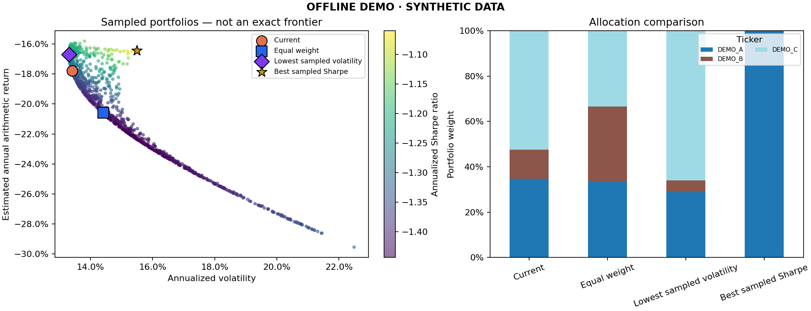

[Projects](#projects) · [LinkedIn](https://www.linkedin.com/in/alejandro-domínguez-lópez) · [Email](mailto:alejandro.dominguez.business@gmail.com)

I'm studying **Economics, Mathematics and Data Science at Universidad Complutense de Madrid**. My interests are increasingly centred on AI, particularly language models, information retrieval and the mathematics behind them.

My recent work includes a retrieval benchmark and **Alego**, a legal-tech project we're developing. I also enjoy financial algorithms, which I'm exploring through a portfolio optimizer that's still in development.

## Projects

### [Retrieval Benchmark](https://github.com/alexdmngz/rag-mpe-benchmark)

**Finalist in the 2025/26 Modelización de Problemas de la Empresa contest.** Developed with Shadi Fedriani Abdallah.

We compared **BM25, dense and hybrid retrieval** with a Gemini baseline on **70 multiple-choice questions** about the *REFRAG* research paper. The study examines answer accuracy, coverage of reference passages and the amount of context supplied to the model.

The pipeline uses **MPNet embeddings in ChromaDB** and a **MiniLM cross-encoder** for reranking. The repository includes the question set, a local BM25 evaluation and the full Gemini experiment, with individual prompts and responses saved alongside the results.

[Code](https://github.com/alexdmngz/rag-mpe-benchmark) · [Report (Spanish)](https://github.com/alexdmngz/rag-mpe-benchmark/blob/main/docs/Report%20%26%20Results.pdf)

### [Portfolio Optimizer](https://github.com/alexdmngz/portfolio-optimizer) · In development

I'm building a Python application to explore how portfolio allocation affects risk and return. It compares current holdings with equal weights, the lowest sampled volatility and the highest sampled Sharpe ratio.

The current version imports CSV or Excel holdings, fetches prices with **yfinance** and evaluates **10,000 random allocations by default** using vectorised NumPy. It has a **Streamlit interface**, a command-line workflow and an offline demo, with exports for allocations, metrics and charts.

The comparison uses historical data from the same sample. Out-of-sample backtesting is not yet implemented.

View the offline demo

*Illustrative output using synthetic prices and holdings.*

[Code](https://github.com/alexdmngz/portfolio-optimizer) · [Methodology](https://github.com/alexdmngz/portfolio-optimizer/blob/main/docs/methodology.md)

## Next projects

### Alego

We're developing a legal-tech project to help analyse and organise legal documents for case preparation. I'm working on the underlying algorithm, with professional review built into the process.

## Toolkit

| Area | Tools |
| --- | --- |
| Languages | Python, R, SQL |
| Data analysis and numerical work | NumPy, Pandas, SciPy, scikit-learn |
| Retrieval and model evaluation | BM25, ChromaDB, Sentence Transformers, Gemini API |
| Applications, charts and data imports | Streamlit, Matplotlib, yfinance, OpenPyXL |
| Development and testing | Git, GitHub Actions, unittest |

My mathematical interests centre on probability, statistical inference, linear algebra and numerical methods.

I'm currently looking for **internship opportunities in AI and data science**. You can reach me at [alejandro.dominguez.business@gmail.com](mailto:alejandro.dominguez.business@gmail.com).
